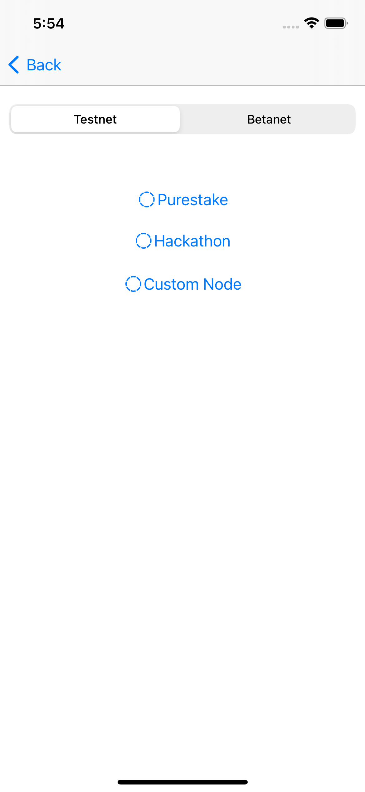
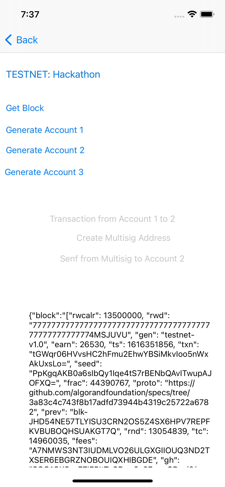
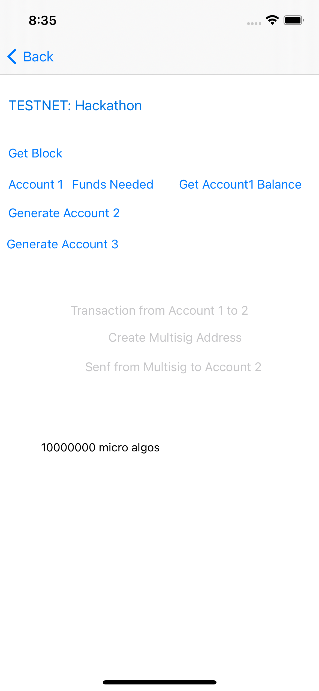
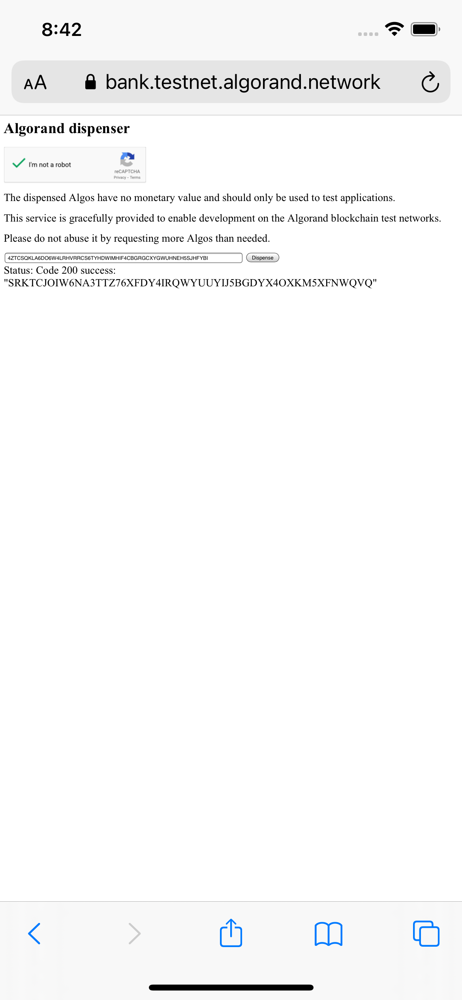
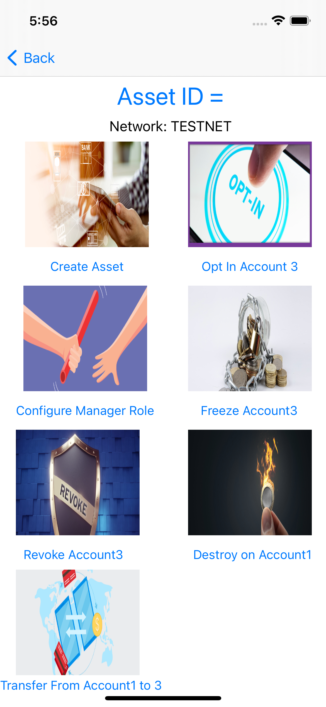
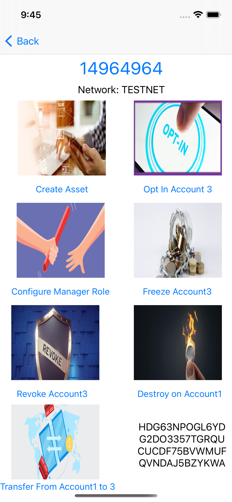
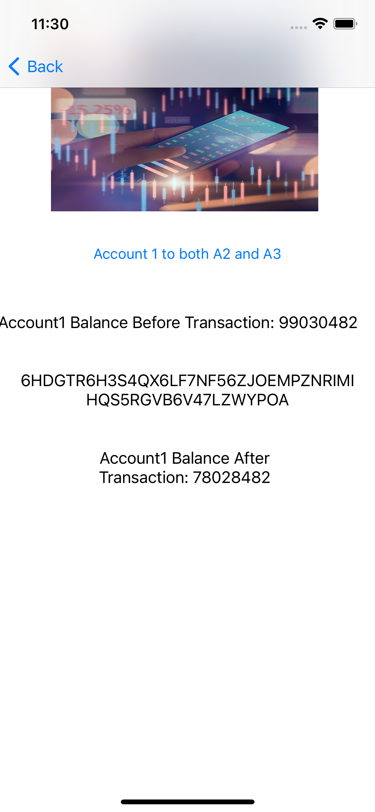

## Build Algorand IOS Apps with the Swift Algorand SDK
This solution shows you how to develop an ios app with the swift algorand sdk bu utilising the swift programming language, this is all thanks to the [swift algorand sdk](https://github.com/Jesulonimi21/Swift-Algorand-Sdk) which has made Algorand more acccessible to  millions of native I0S and swift developers all over the world.

## Table Of Contents
1. [Setup](#setup)
2. [Application Structure](#application-structure)
3. [Node And Network Settings](#node-and-network-settings)
4. [Accounts and Transactions](#accounts-and-transactions)
5. [Create and Fund Accounts](#create-and-fund-accounts)
6. [Transactions](#transactions)
7. [Multisig Transaction](#multisig-transaction)
8. [ASA](#asa)
9. [Atomic Transfer](#atomic-transfer)
10. [Algorand Smart Contract](#algorand-smart-contract)
11. [Conclusion](#conclusion)

# Setup
Make sure you have [Xcode](https://apps.apple.com/us/app/xcode/id497799835?mt=12) installed, preferrably from the apple store, this tutorial uses Xcode 12.4  which is the latest at the time, you can then proceed to clone the project from this [repo](https://github.com/Jesulonimi21/swift-algorand-sdk-ios-showcase), after cloning it, all you need to do is open its root directory in terminal and run the code below to install its dependencies:
```bash
pod install
```
After that, you are good to go and can decide to run the app as you please.By default, you are connected to the Hackathon testnet node , this is so that the app can be tested smoothly without having to expose tokens or running a custom node.

# Node And Network Settings
The Node and Network settings screen allows you to select the network and node  that the app will use for the configuration of the AlgodClient in other classes(Screens), this ends up changing the value of the static `algodClient` variable in the `Config.swift` file.
All the code for this page can be found in the `NodeAndNetworkSettingsController.swift` file.

<div style="text-align:center">
 
</div>


Lets look at the code that is  run when purestake is clicked for example

```swift
@IBAction func selectPurestakeNode(_ sender: DLRadioButton) {
        Config.currentNode="Purestake"
        if(Config.currentNet==Config.TESTNET){
            var algodClient:AlgodClient=AlgodClient(host: Config.PURESTAKE_ALGOD_API_TESTNET_ADDRESS, port: Config.PURESTAKE_API_PORT, token: Config.PURESTAKE_API_KEY)
            algodClient.set(key: "X-API-Key")
            Config.algodClient=algodClient
        }else{
            var algodClient:AlgodClient=AlgodClient(host: Config.PURESTAKE_ALGOD_API_BETANET_ADDRESS, port: Config.PURESTAKE_API_PORT, token: Config.PURESTAKE_API_KEY)
            algodClient.set(key: "X-API-Key")
            Config.algodClient=algodClient
        }
  
    }
```
The code above is pretty simple, we simply set the `currentNode` value to Purestake. then we check next if the `currentNet`(Network) is testnet or mainnet then proceed to call the AlgodClient constructor with the right `host` address, `port` and `token`. You can go on to check the respective methods for connecting to Hackathon or a Custom Node

Note: Please make sure you have placed a value for the `Config.PURESTAKE_API_KEY` in the `Config.swift` file for this to work properly.

## Accounts and Transactions
Please open the `AccountsAndTransactionsController.swift` file, you can click on the Get Block Button and you'll see the loading indicator and after, you'll see information on the Current Block in the scrollable text area.
<div style="text-align:center">
 
</div>
The methods for this can be found below

```swift
 @IBAction func getBlockInfo(_ sender: Any) {
        var algodClient=Config.algodClient
        showLoader()
        algodClient!.getStatus().execute(){nodeStatusResponse in
               if(nodeStatusResponse.isSuccessful){
                
                algodClient!.getBlock(round: nodeStatusResponse.data!.lastRound!).execute(){ blockResponse in
                    
                    self.hideLoader()
                    if(blockResponse.isSuccessful){

                        self.informationLabel.text=blockResponse.data!.toJson()!.replacingOccurrences(of: "\\", with: "")
                    }else{
                        self.informationLabel.text=(blockResponse.errorDescription!)
                        
                    }
                    
                
                }
                
             
              
               }else{
                self.hideLoader()
             
                self.informationLabel.text=nodeStatusResponse.errorDescription
               }
       
           }
    }
```
The code above is pretty simple, we first of all initialize the `algodClient`, show a loader and then we proceed to get its status by calling the `getStatus` method, so we can get the last round and pass it to the query for getting the Block with the `getBlock` method.Finally we check if there was an error and update textView and hide the loader

## Create and Fund Accounts
You can decide to create Three accounts, `Generate Account Button` and you'll see the option to fund an account or get its account balance,
if you choose the option to fund account, you'll be taken to the respective dispenser page for [testnet](https://bank.testnet.algorand.network/) or [betanet](https://bank.betanet.algodev.network/) and automatically, the address for the respective account is copied to the clipboard so it can be pasted in the input field of the dispenser, after funding the account, you can click the Get account Balance button to confirm the amount in the account


<div style="text-align:center">
 &nbsp;&nbsp;&nbsp;&nbsp;&nbsp;&nbsp;&nbsp;&nbsp;&nbsp;&nbsp;&nbsp;&nbsp;&nbsp;&nbsp;&nbsp;&nbsp;&nbsp;&nbsp;&nbsp;&nbsp;&nbsp;&nbsp;&nbsp;&nbsp;&nbsp;&nbsp;&nbsp;&nbsp;&nbsp;&nbsp;&nbsp;&nbsp;&nbsp;&nbsp;&nbsp;&nbsp;&nbsp;&nbsp;&nbsp;&nbsp;&nbsp;&nbsp;&nbsp;&nbsp;
 
</div>
the code to create account can be found below
```swift
    @IBAction func generateAccount1(_ sender: Any) { 
        var account =  try! Account()
        self.informationLabel.text="Mnemonic: \(account.toMnemonic())\n Address: \(account.address.description)"
        Config.account1=account
        generateAccount1Button.setTitle("Account 1", for: .normal)
        account1FundsNeededButton.isHidden=false
        account1FundsNeededButton.setTitle("Funds Needed", for: .normal)
        account1GetAccountBalanceButton.isHidden=false
        account1GetAccountBalanceButton.setTitle("Get Account1 Balance", for: .normal)
    }
```
Feel free to check out the code for Checking Account Balance and Funding the account in the `AccountsAndTransactionsController.swift` file


## Transactions
Now, we can proceed to allow the transfer of funds from account 1 to 2, the `Transfer From Account 1 to 2` button should no longer be greyed out after generating account 1 and 2, you can clivk on it to transfer funds from account 1 to 2, after the funds have been transferred, you should be able to see the transaction id in the info text and if you clicked on `Get Account2 Balance`, you should see the account balance

```swift
  func transferFunds(sender:Account,receiverAddress:Address){
        showLoader()
        var trans =  Config.algodClient!.transactionParams().execute(){ paramResponse in
                    if(!(paramResponse.isSuccessful)){
                    print(paramResponse.errorDescription);
                        self.hideLoader()
                    return;
                }
        
        
            var tx = Transaction.paymentTransactionBuilder().setSender(sender.address)
                    .amount(1000000)
                    .receiver(receiverAddress)
                    .note("Swift Algo sdk is cool".bytes)
                    .suggestedParams(params: paramResponse.data!)
                    .build()
          
                    var signedTransaction=sender.signTransaction(tx: tx)
        
                    var encodedTrans:[Int8]=CustomEncoder.encodeToMsgPack(signedTransaction)
        
        
        
            Config.algodClient!.rawTransaction().rawtxn(rawtaxn: encodedTrans).execute(){
                       response in
                self.hideLoader()
                        if(response.isSuccessful){
                          
                            self.informationLabel.text="\(response.data!.txId)"
                            UIPasteboard.general.string="\(response.data!.txId)"
                            
                        }else{
                           
                            self.informationLabel.text=response.errorDescription!
                            UIPasteboard.general.string=response.errorDescription!
                      
                        }
        
                    }
            }
    
    }
```
The `transferFunds` function  builds a transaction by calling the `TransactionPaymentBuilder`, and calling methods for amount, note, suggestedParams on it, it then signs the transaction using the account its function receives and sends a messagepack of the signed transaction to the algorand network and updates the information label below with the transaction id if it was successfull or with the error if it wasnt


## Multisig Transaction
You can click on the `Create Multisig Address button`, this will create a multisig address  and place the multisig address on the clipboard so it can be pasted in the dispenser to fund the multisig address. 
The code to fund the multisig address can be found below

```swift
  func createMultisigAddress(address1:Address,address2:Address,address3:Address){
        var ed25519i = Ed25519PublicKey(bytes:address1.bytes!)
        var ed25519ii=Ed25519PublicKey(bytes:address2.bytes!)
        var ed25519iii=Ed25519PublicKey(bytes:address3.bytes!)
    
        self.multisigAddress = try! MultisigAddress(version: 1, threshold: 2, publicKeys: [ed25519ii,ed25519i,ed25519iii])
        self.informationLabel.text=multisigAddress!.toString()
        UIPasteboard.general.string=multisigAddress!.toString()
    }
```
It simply gets the ed25519 public key for each address and passes  an array of them  to the `MultisigAddress` constructor to create the multisig address, it uses a version of 1 and threshold of 2. The threshold represents the number of valid signers that must provide signatures for the transaction to be successfull.

After funding the multisig adddress by recharging it in the explorer, you can go ahead to click on the `Send From Multisig to Accoun 2 ` button and this should send 1 algo to account 2 displaying the transaction id in the info text at the bottom of the string, the transaction id is automatically copied to the clipboard so this can be inspected.
The code for this can be found below
```swift
func sendMultisigTransaction(account1:Account,account2:Account,receiverAddress:Address){
        showLoader()
        Config.algodClient!.transactionParams().execute(){ paramResponse in
            if(!(paramResponse.isSuccessful)){
                print(paramResponse.errorDescription);
                self.hideLoader()
                self.informationLabel.text="\(paramResponse.errorDescription!)"
                UIPasteboard.general.string="\(paramResponse.errorDescription!)"
                return;
            }
    
            var tx = Transaction.paymentTransactionBuilder()
                .setSender( try! self.multisigAddress!.toAddress())
                  .amount(1000000)
                .receiver(receiverAddress)
                .suggestedParams(params: paramResponse.data!)
                          .build();
    
            var IsignedTrans = try! account1.signMultisigTransaction(from: self.multisigAddress!, tx: tx)
            var signedTrans=try!account2.appendMultisigTransaction(from: self.multisigAddress!, signedTx: IsignedTrans)
            var signedTransmsgPack=CustomEncoder.convertToUInt8Array(input: CustomEncoder.encodeToMsgPack(signedTrans))
            var int8sT:[Int8] = CustomEncoder.encodeToMsgPack(signedTrans)
            var jsonEncoder=JSONEncoder()
            var txData=try! jsonEncoder.encode(signedTrans)
            var txString=String(data: txData, encoding: .utf8)
      
            Config.algodClient!.rawTransaction().rawtxn(rawtaxn: CustomEncoder.encodeToMsgPack(signedTrans)).execute(){
               response in
                self.hideLoader()
                if(response.isSuccessful){
                
                    self.informationLabel.text="\(response.data!.txId)"
                    UIPasteboard.general.string="\(response.data!.txId)"
                    
                }else{
                    self.informationLabel.text=="\(response.errorDescription!)"
                    UIPasteboard.general.string="\(response.errorDescription!)"
                }
    
            }
        }
    
        
    }
```
The transaction is conducted using the multisig address as the sender and then signed by `account1` and the `SignedTransaction` object is signed again by `account2` using the `appendMultisigTransaction` method, and then the signed transaction returned is sent to the network. The transaction id is displayed in the information text field and also copied to the clipboard so it can be inspected in the [explorer](https://testnet.algoexplorer.io/) 


## ASA
Next, you can click on the `Algorand Standard Assets` , this will take you to the page below:
 <div style="text-align:center">
 
</div>

The order in  which we will go through on this page is to click on `Create Asset`  then `Configure Manager Role` then `Opt in Account3` then `Transfer From Acccount1 to 3`,then `Freeze Account3` then `Revoke Account3`  then `Destroy on Account1`

**Create Asset:** You can click `Create Asset` and you should see the progress bar loading until the transaction completes, once the transaction completes, you should be able to see the Asset Id aat the top and the transaction id at the bottom right of the screen like below:


 <div style="text-align:center">
 
</div>

The code for this can be found in the `AlgorandAssetsController.swift` file, it is handled by the `createASA` function which can be found below: 

```swift
 func createASA( algodClient:AlgodClient,creator:Account,assetTotal:Int64,assetDecimals:Int64,assetUnitName:String,assetName:String,url:String,manager:Address,reserve:Address,freeze:Address,clawback:Address,defaultFrozen:Bool,functionToCall:@escaping (Int64?)->Void){
        algodClient.transactionParams().execute(){paramResponse in
            if(!(paramResponse.isSuccessful)){
                print(paramResponse.errorDescription);
                return;
            }
     var tx = Transaction.assetCreateTransactionBuilder()
        .setSender(creator.getAddress())
                          .setAssetTotal(assetTotal: assetTotal)
                          .setAssetDecimals(assetDecimals:  assetDecimals)
                          .assetUnitName(assetUnitName: assetUnitName)
                          .assetName(assetName:  assetName)
                            .url(url: url)
                            .manager(manager: manager)
                            .reserve(reserve: reserve)
                            .freeze(freeze: freeze)
                          .defaultFrozen(defaultFrozen:  defaultFrozen)
                .clawback(clawback: clawback)
        .suggestedParams(params: paramResponse.data!).build()
         
            var signedTransaction=creator.signTransaction(tx: tx)
            var encodedTrans:[Int8]=CustomEncoder.encodeToMsgPack(signedTransaction)
            var dataToSend=Data(CustomEncoder.convertToUInt8Array(input: encodedTrans))
       
            algodClient.rawTransaction().rawtxn(rawtaxn: encodedTrans).execute(){
               response in
                if(response.isSuccessful){
                    print(response.data!.txId)
                    self.infoLabel.text=response.data!.txId
                    self.waitForTransaction(txId:response.data!.txId,funcToCall: functionToCall)
                  
                }else{
                    print(response.errorDescription)
                    self.infoLabel.text=response.errorDescription
                }
            }

        }

    }   
```
we simply create the transaction by calling in the `assetCreateTransactionBuilder` on the `Transaction`  class, we pass in account2 as the creator, manager, reserve, clawback and freeze, we also pass in parameters for the `assetTotal`, `unitName` and `defaultFrozen`, we then sign the transaction with the `creator` and send it to the network, we wait for the transaction to be confirmed by calling the `self.waitForTransaction` method before proceeding.
```swift
 
    func waitForTransaction(txId:String, funcToCall: @escaping (Int64?)->Void) {
        var confirmedRound: Int64?=0
        var assetIndex:Int64?=0
        algodClient!.pendingTransactionInformation(txId:txId).execute(){
            pendingTransactionResponse in
                if(pendingTransactionResponse.isSuccessful){
                    confirmedRound=pendingTransactionResponse.data!.confirmedRound
                    assetIndex=pendingTransactionResponse.data!.assetIndex
                    if(confirmedRound != nil && confirmedRound! > 0){
                       funcToCall(assetIndex)
                    }else{
                        try!  self.waitForTransaction(txId: txId,funcToCall: funcToCall)
                    }
                }else{
                    print(pendingTransactionResponse.errorDescription!)
                    funcToCall(nil)
                }
    }
}
```

**Configure Manager:** Now, we can proceed to change the manager to Account1, this is done by calling the `assetConfigureTransactionBuilder()` and then calling then chaining other methods responsible for the necessary configuration, the code that does this can be found below, please note that you have to pass in the asset index of the already created asset and then sign the transaction by `account2` (the present manager):
```swift
 func  changeAsaManager(algodClient:AlgodClient,previousManager:Account,assetIndex:Int64,manager:Address,reserve:Address,freeze:Address,clawback:Address,functionToCall:@escaping (String?)->Void){
        
        algodClient.transactionParams().execute(){paramResponse in
            if(!(paramResponse.isSuccessful)){
                print(paramResponse.errorDescription);
                return;
            }
            var tx = Transaction.assetConfigureTransactionBuilder().reserve(reserve: previousManager.address).freeze(freeze: previousManager.address).clawback(clawback: previousManager.address).assetIndex(assetIndex: assetIndex).setSender(previousManager.getAddress())
            .manager(manager: manager)
                .suggestedParams(params: paramResponse.data!)
                      .build();
       
       
            var signedTransaction=previousManager.signTransaction(tx: tx)
          
            var encodedTrans:[Int8]=CustomEncoder.encodeToMsgPack(signedTransaction)
            var dataToSend=Data(CustomEncoder.convertToUInt8Array(input: encodedTrans))
            algodClient.rawTransaction().rawtxn(rawtaxn: encodedTrans).execute(){
               response in
                if(response.isSuccessful){
                    functionToCall(response.data!.txId)
                    
                }else{
                    functionToCall(response.errorDescription)
                }
    
            }
    
        }
    
    }
```

**Opt-In:**  Now, we will proceed to opting in `account3` to our created ASA, this sends 0 amount of the createc asset to `account3`, for this to work, `account3` has to be the signer of this transaction, the code for this can be found below:
```swift
  func optInToAsa(algodClient:AlgodClient,acceptingAccount:Account,assetIndex:Int64,functionToCall:@escaping (String)->Void){
    
        algodClient.transactionParams().execute(){paramResponse in
            if(!(paramResponse.isSuccessful)){
                print(paramResponse.errorDescription);
                return;
            }
            var tx = Transaction.assetAcceptTransactionBuilder()
                .acceptingAccount(acceptingAccount: acceptingAccount.getAddress())
                .assetIndex(assetIndex: assetIndex)
                .suggestedParams(params: paramResponse.data!)
                .build();
    
            var txMessagePack:[Int8]=CustomEncoder.encodeToMsgPack(tx)
            var signedTrans=acceptingAccount.signTransaction(tx: tx)
            var encodedTx:[Int8]=CustomEncoder.encodeToMsgPack(signedTrans)
            algodClient.rawTransaction().rawtxn(rawtaxn: encodedTx).execute(){
               response in
                if(response.isSuccessful){
                    functionToCall(response.data!.txId)
                }else{
                    functionToCall(response.errorDescription!)
                }
    
            }}   
    }
```
The function above simply receives the `account`, the `assetIndex` and the `callBack`, calls the `assetAcceptTransactionBuilder` on the `Transaction` class and chains the  `acceptingAccount` and the  `assetIndex` method while passing in theor respective values and then callling the `callBack` with the transaction id.

**Transfer Asset:** We will transfer our 10 tokens of our asset from `account2` to `account3`, this can be done by clicking on the `Transfer to Account3` button. The code for this can be found below
```swift
 func transferAsa(algodClient:AlgodClient,sender:Account,receiver:Address,amount:Int64,assetIndex:Int64, functionToCall:@escaping (String)->Void){

        algodClient.transactionParams().execute(){paramResponse in
            if(!(paramResponse.isSuccessful)){
                print(paramResponse.errorDescription);
                return;
            }

            var tx = Transaction.assetTransferTransactionBuilder().setSender(sender.getAddress()).assetReceiver(assetReceiver:receiver)
                .assetAmount(assetAmount:amount).assetIndex(assetIndex:assetIndex).suggestedParams(params:paramResponse.data!).build();

            var signedTrans=sender.signTransaction(tx: tx)
            
            var encodedTx:[Int8]=CustomEncoder.encodeToMsgPack(signedTrans)
            algodClient.rawTransaction().rawtxn(rawtaxn: encodedTx).execute(){
               response in
                if(response.isSuccessful){
                    functionToCall(response.data!.txId)
                }else{
                    functionToCall(response.errorDescription!)
                }

            }
        }

    }
```
The function above calls the `assetTransferTransactionBuilder` method on the `Transaction` class and chains the necessary methods with the method call to transfer the asset, the sender signs the transaction and sends it to the network.

**Freeze Asset:** Next, we will see how to freeze an asset by clicking on the `Freeze Asset` button, we will freeze the assets in `account3`, the freeze transaction is created by calling `assetFreezeTransactionBuilder` on the `Transaction` class and chaining the `freezeTarget` which signifies the account to freeze and the `freezeState` which signifies if to freeze or unfreeze the account, while passing in their respective parameters. The signer of this transaction has to be the `manager` which is `account1`
The code responsible for this can be found below:
```swift
    
    func freezeASA(algodClient:AlgodClient,freezeTarget:Address,manager:Account,assetIndex:Int64,freezeState:Bool, functionToCall:@escaping (String)->Void){
    
        algodClient.transactionParams().execute(){paramResponse in
            if(!(paramResponse.isSuccessful)){
                print(paramResponse.errorDescription);
                return;
            }
    
            var tx=Transaction.assetFreezeTransactionBuilder().setSender(manager.getAddress()).freezeTarget(freezeTarget:freezeTarget)
                .freezeState(freezeState:freezeState).assetIndex(assetIndex: assetIndex).suggestedParams(params: paramResponse.data!).build();
            var signedTrans=manager.signTransaction(tx: tx)
            var encodedTx:[Int8]=CustomEncoder.encodeToMsgPack(signedTrans)
            algodClient.rawTransaction().rawtxn(rawtaxn: encodedTx).execute(){
               response in
                if(response.isSuccessful){
                    functionToCall(response.data!.txId)
                }else{
                    functionToCall(response.errorDescription!)
                }
    
            }
        }
    }
```

**Revoke Asset:** We will now revoke the assets sent to account3 earlier, we do this by calling the `assetClawbackTransactionBuilder` method `Transaction` class  and pass in the address of `account3` to the chained `assetClawbackFrom`, method and  the address of `account1` to the chained `assetReceiver` method  while chaining the remaining methods for `assetAmount` and `assetIndex`. The created transaction has to be signed by the manager which is `account2`, the code for this can be found below: 

```swift
func revokeAsa(algodClient:AlgodClient,manager:Account,clawBackFromAddress:Address,clawBackToAddress:Address,assetAmount:Int64,assetIndex:Int64, functionToCall:@escaping (String)->Void){
        algodClient.transactionParams().execute(){paramResponse in
            if(!(paramResponse.isSuccessful)){
                print(paramResponse.errorDescription);
                return;
            }

            var tx = Transaction.assetClawbackTransactionBuilder().setSender(manager.getAddress())
                .assetClawbackFrom(assetClawbackFrom:clawBackFromAddress).assetReceiver(assetReceiver: clawBackToAddress).assetAmount(assetAmount: assetAmount)
                .assetIndex(assetIndex:assetIndex).suggestedParams(params: paramResponse.data!).build()
            var signedTrans=manager.signTransaction(tx: tx)
            var encodedTx:[Int8]=CustomEncoder.encodeToMsgPack(signedTrans)
            algodClient.rawTransaction().rawtxn(rawtaxn: encodedTx).execute(){
               response in
                if(response.isSuccessful){
                    functionToCall(response.data!.txId)
                }else{
                    functionToCall(response.errorDescription!)
                }

            }
        }
    }
```

**Destroy Asset:** We can now the destroy the asset by clicking on the `Destroy On Account1` For us to do this, the `Creator` of the asset has to have all the units of the asset in its account and also sign the transaction, the code for this can be found below:

```swift

    func destroyAsa(algodClient:AlgodClient,manager:Account,assetIndex:Int64,functionToCall:@escaping (String)->Void){
        algodClient.transactionParams().execute(){paramResponse in
            if(!(paramResponse.isSuccessful)){
                print(paramResponse.errorDescription);
                return;
            }
            var tx = Transaction.assetDestroyTransactionBuilder()
                .setSender(manager.getAddress())
                .assetIndex(assetIndex: assetIndex)
                .suggestedParams(params: paramResponse.data!)
                          .build();

            var signedTrans=manager.signTransaction(tx: tx)
            var encodedTx:[Int8]=CustomEncoder.encodeToMsgPack(signedTrans)
            algodClient.rawTransaction().rawtxn(rawtaxn: encodedTx).execute(){
               response in
                if(response.isSuccessful){
                    functionToCall(response.data!.txId)
                }else{
                    functionToCall(response.errorDescription!)
                }

            }}

    }
```
We simply call `assetDestroyTransactionBuilder` on the `Transaction` class while chaining the necessary methods on it and then proceed to sign the transaction with the `creator` account.


## Atomic Transfer
Atomic transfers are used to send more than one transaction to the network at a time such that if any of the transactions fail, all the transactions fail, we will do this by sending 10 and 15 algo respectively to `account1` and `account2` from `account3`

<div style="text-align:center">
 
</div>
The code responsible for this can be found below

```swift
func createtransactions(sender:Account,receiver1:Address,receiver2:Address,algodClient:AlgodClient,functionToCall: @escaping (String)->Void){
        algodClient.transactionParams().execute(){ paramResponse in
           if(!(paramResponse.isSuccessful)){
           print(paramResponse.errorDescription);
           return;
       }
            var tx1 = Transaction.paymentTransactionBuilder().setSender(sender.address)
             .amount(10000000)
             .receiver(receiver1)
             .note("Swift Algo sdk is cool".bytes)
             .suggestedParams(params: paramResponse.data!)
             .build()
 
            var tx2 = Transaction.paymentTransactionBuilder().setSender(sender.getAddress())
              .amount(11000000)
              .receiver(receiver2)
              .note("Swift Algo sdk is cool".bytes)
              .suggestedParams(params: paramResponse.data!)
              .build()
            var transactions=[tx1,tx2]
            var gid = try! TxGroup.computeGroupID(txns: transactions)
            var signedTransactions:[SignedTransaction?]=Array(repeating: nil, count: transactions.count)
            for i in 0..<transactions.count{
                transactions[i].assignGroupID(gid: gid)
                signedTransactions[i]=sender.signTransaction(tx: transactions[i])
            }
            self.makeAtomicTransfer(signedTransactions: signedTransactions, algodClient: algodClient,functionToCall: functionToCall)
            
        }
    }
```
We simply create the two payment transactions in the function above and comput their `Group Id`, this is what identifies both transactions as belonging to the same group when sent to the network
we then sign both transactions and send them to the `makeAtomicTransfer` function.

```swift
public func makeAtomicTransfer(signedTransactions:[SignedTransaction?],algodClient:AlgodClient,functionToCall: @escaping (String)->Void){
        var encodedTrans:[Int8]=Array()
        for i in 0..<signedTransactions.count{
            encodedTrans = encodedTrans+CustomEncoder.encodeToMsgPack(signedTransactions[i])
        }
              
    
                algodClient.rawTransaction().rawtxn(rawtaxn: encodedTrans).execute(){
                   response in
                    if(response.isSuccessful){
                        functionToCall(response.data!.txId)
                    }else{
                        functionToCall(response.errorDescription!)
                    }
    
                }
    }
```
the  `makeAtomicTransfer` function simply computes the messagepack of both signed transactions and sends them to the network. the `waitForTransactions` method is used to wait till the transaction has been confirmed by the network.

## Algorand Smart Contract